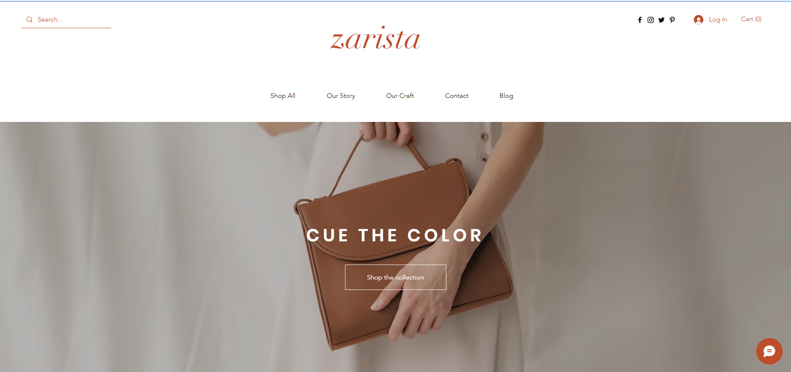
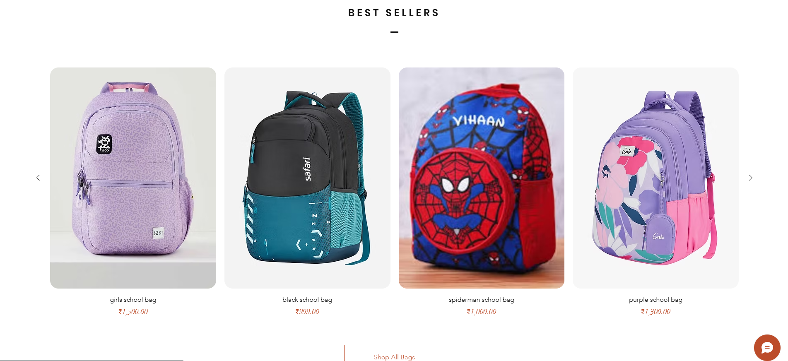
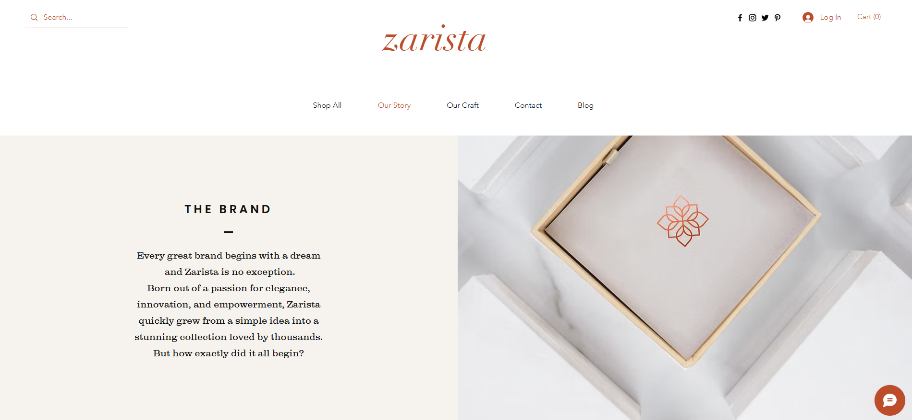
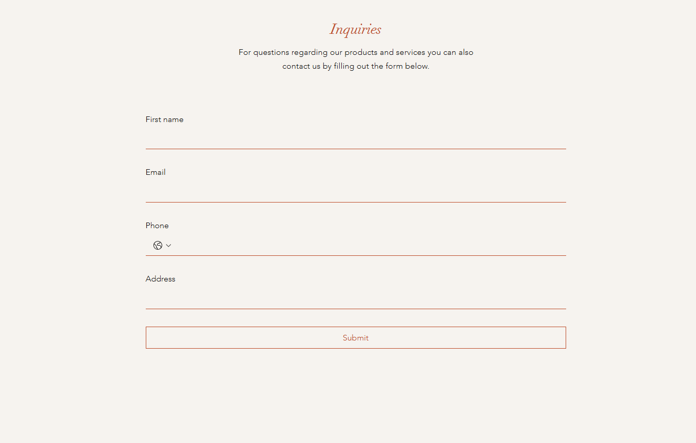

# 🛍️ Bazila - Wix E-Commerce Website

## 🌐 Live Website

🔗 https://chetancollegeofcom4.wixsite.com/bazila

---

## 📖 About The Project

Bazila is an e-commerce website created using the Wix platform. The website provides a simple and responsive online shopping experience where users can browse products and explore the store through an intuitive interface.

The project demonstrates website design, navigation structure, responsive layouts, and online store management using Wix's drag-and-drop website builder.

---

## ✨ Features

- Responsive Design
- Product Showcase
- User-Friendly Navigation
- Mobile Friendly Layout
- Contact Information Section
- Modern UI Design
- Wix Hosting Integration

---

## 🛠️ Technologies Used

- Wix Website Builder
- Wix Hosting
- Wix Templates
- SEO Optimization
- HTML (Generated by Wix)
- CSS (Generated by Wix)

---

## 📸 Website Screenshots

### Home Page

### Product Page

### About Us Page

### Contact Page

---

## 🚀 How to View the Website

Click the live website link below:

👉 https://chetancollegeofcom4.wixsite.com/bazila

---

## 👨‍🎓 Academic Project

This website was developed as a web development project using the Wix platform to demonstrate website creation and online business presentation.

---

## 👤 Author

**Bazila Anjum**

Bachelor of Computer Applications (BCA)
